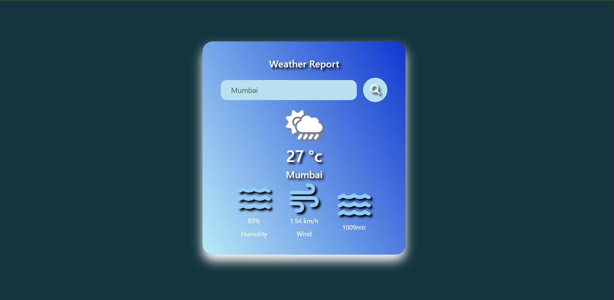

# 🌦️ Weather App

A simple and responsive Weather App built using **HTML**, **CSS**, and **JavaScript** that fetches real-time weather data using the **OpenWeatherMap API**.

## 📸 Preview

 <!-- Add your screenshot image in your repo -->

## 🚀 Features

- 🌍 Search weather by city name
- 🌡️ Shows temperature in Celsius
- 💨 Displays wind speed and humidity
- 🕐 Real-time weather updates
- 📱 Responsive design for mobile and desktop

## 🛠️ Built With

- **HTML5** – Structure of the application
- **CSS3** – Styling and responsive layout
- **JavaScript (Vanilla JS)** – Fetch API & DOM manipulation
- **OpenWeatherMap API** – Real-time weather data

## 📂 Folder Structure

📌 Future Improvements

🌤️ Add weather icons
📍 Geolocation-based weather
🌙 Dark/light theme toggle
🌐 Language & unit conversion support
